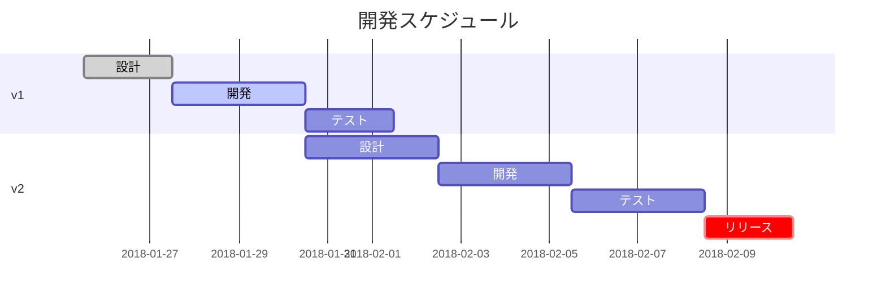

# stats

## チェック
* お試し
* 試し
* うまくいってほしいな

## vscodeとgithubの連携方法

## スケジュール

```mermaid
gantt
  title 開発スケジュール
  section v1
    設計 :done, design, 2018-01-25 12:00:00, 2d
    開発 :active, coding, after design, 3d
    テスト :test, after coding, 2d
  section v2
    設計 :design2, after coding, 3d
    開発 :coding2, after design2, 3d
    テスト :test2, after coding2, 3d
    リリース :crit, deploy,  after test2, 2d
```