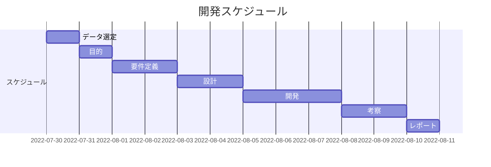

## アップデート情報
* version 1.0 : ガントチャート作成、開発に使った参考資料リンク置き場作成

## スケジュール

## 参考資料集
[gitコマンド](https://docs.microsoft.com/ja-jp/azure/developer/javascript/how-to/with-visual-studio-code/clone-github-repository?tabs=create-repo-command-palette%2Cinitialize-repo-activity-bar%2Ccreate-branch-command-palette%2Ccommit-changes-command-palette%2Cpush-command-palette)

[mermaid.jsを用いたガントチャート作成](https://qiita.com/miriwo/items/7df0024d4098302e5721)

[vscodeとgithub, gitを連携させるには](https://miya-system-works.com/blog/detail/vscode-github/)

##　
