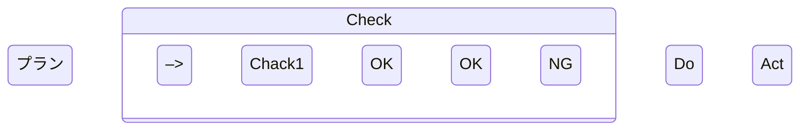

# 要件定義
| 大項目 | 項目  | 概要  |
| :----: | :---: | :---: |
| ファイル読み込み |  csvファイル読み込み  | 同ディレクトリに存在するcsvファイルを読み込む   |
| ^ | jsonファイル読み込み | 同ディレクトリに存在するjsonファイルを読み込む|
|分析結果の表示|表形式の分析結果の表示|csv、jsonファイルをもとに、テーブルの作成|
| ^ |グラフ形式の分析結果の表示|csv, jsonファイルをもとに、グラフの作成|
|分析結果の保存|図表を保存|表、図の結果を画像として保存する|

# フローチャート
